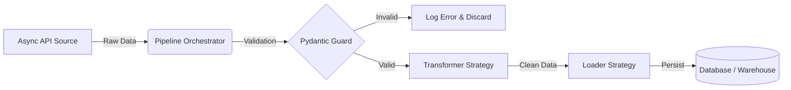

# Auror-IA: High-Performance ETL Pipeline


> **"Más allá de un script: Ingeniería de Software aplicada a Datos."**

**Auror-IA** es un motor de extracción, transformación y carga (ETL) de próxima generación. A diferencia de los scripts lineales tradicionales, este sistema implementa una **Arquitectura Orientada a Objetos** robusta, **Concurrencia Asíncrona** y **Validación Estricta de Tipos**.

Diseñado para ser agnóstico a la fuente de datos, escalable y mantenible bajo estándares empresariales (SOLID, Clean Code).

---

## Arquitectura del Sistema

El proyecto utiliza el patrón de diseño **Strategy** para desacoplar la lógica de extracción, transformación y carga. El orquestador (`Pipeline`) no conoce los detalles de implementación, solo las interfaces.



### Stack Tecnológico

Este proyecto demuestra el dominio del ecosistema moderno de Python:

#### Core:
- **Python 3.10+** (Type Hinting, Dataclasses)

#### Concurrencia:
- **AsyncIO + aiohttp** (Rendimiento 10x superior a requests sincrónico)

#### Validación de Datos:
- **Pydantic v2** (Contratos de datos y manejo de errores "Fail-Fast")

#### Persistencia:
- **SQLAlchemy** (ORM compatible con SQLite, PostgreSQL, MySQL)

#### Calidad de Código (Governance):
- **Ruff**: Linter y formateador de alto rendimiento
- **MyPy**: Chequeo estático de tipos (Static Type Checking)
- **Pre-commit**: Hooks de Git para asegurar calidad antes de cada commit

#### Testing & CI/CD:
- **Pytest + Pytest-Asyncio + Pytest-Mock**: Frameworks de pruebas unitarias y asíncronas
- **GitHub Actions**: Pipeline automatizado de pruebas y linting

#### Seguridad:
- **python-dotenv**: Gestión de secretos mediante variables de entorno


Estructura del Proyecto

```text
auroria_etl_pipeline/
├── .github/workflows/      # CI/CD: Automatización con GitHub Actions
├── data/                   # Almacenamiento local (SQLite, Parquet, Logs)
├── src/                    # Código Fuente
│   ├── extractor.py        # Lógica de extracción asíncrona (AsyncIO)
│   ├── interfaces.py       # Contratos abstractos (Protocolos/ABCs)
│   ├── loader.py           # Lógica de carga a Base de Datos
│   ├── schemas.py          # Modelos Pydantic (Validación)
│   └── transformer.py      # Lógica de limpieza y NLP
├── tests/                  # Suite de pruebas unitarias (Mocks)
├── .env                    # Variables de entorno (Ignorado por Git)
├── .pre-commit-config.yaml # Configuración de Hooks de Git
├── main.py                 # Punto de entrada (Orquestador)
├── pyproject.toml          # Configuración centralizada (Ruff, MyPy)
└── requirements.txt        # Dependencias
```

Instalación y Configuración
Sigue estos pasos para levantar el entorno de desarrollo localmente:

1. Clonar el repositorio
```bash
git clone [https://github.com/DKAstaroth/auroria_etl_pipeline.git](https://github.com/DKAstaroth/auroria_etl_pipeline.git)
cd auroria_etl_pipeline
```
2. Configurar Entorno Virtual

# Windows
```bash
python -m venv venv
.\venv\Scripts\activate
```
# Linux/Mac
```bash
python3 -m venv venv
source venv/bin/activate
```
3. Instalar Dependencias
```bash
pip install -r requirements.txt
```
4. Configurar Variables de Entorno
Crea un archivo .env en la raíz del proyecto basándote en este ejemplo:

# .env

```ini
# .env
API_URL=[https://jsonplaceholder.typicode.com/posts](https://jsonplaceholder.typicode.com/posts)
API_LIMIT=100
DB_PATH=data/auroria.db
DB_TABLE_NAME=news_feed
ENVIRONMENT=DEVELOPMENT
```
5. Configurar Hooks de Calidad (Opcional pero recomendado)
Instala los git hooks para que revisen tu código automáticamente antes de cada commit:
```bash
pre-commit install
```
Ejecución
Para correr el pipeline completo (Extracción Asíncrona -> Validación -> Transformación -> Carga):
```bash
python main.py
```